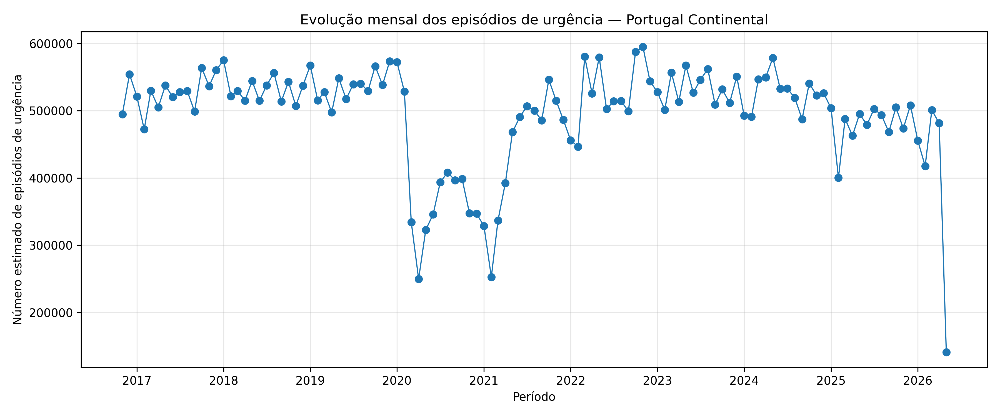
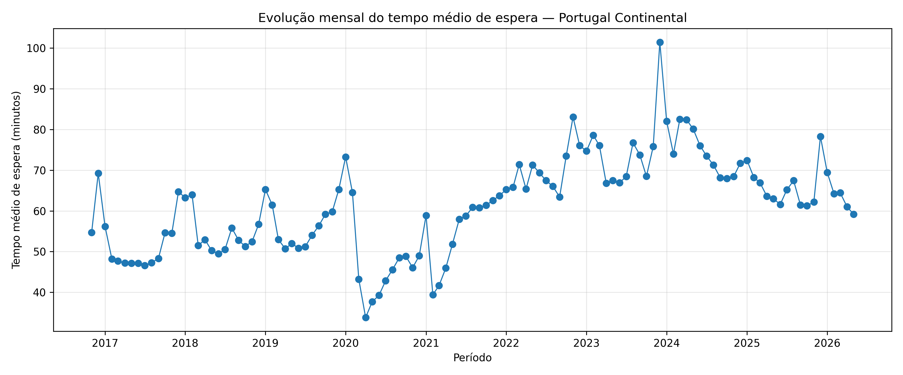
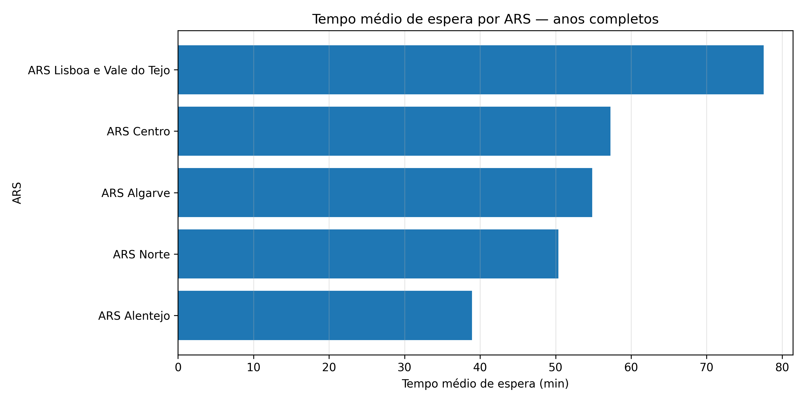
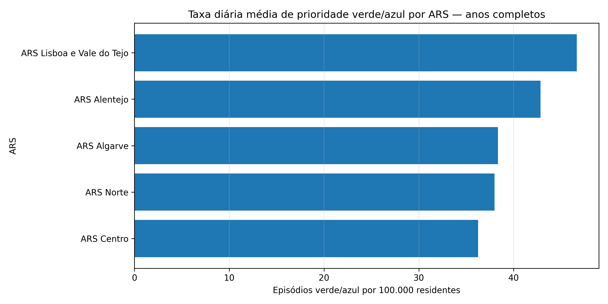

# Análise exploratória da pressão assistencial nas urgências hospitalares do SNS

## Descrição do projeto

Este projeto analisa indicadores públicos de urgência hospitalar em Portugal Continental, com o objetivo de explorar padrões temporais e regionais associados à pressão assistencial nos serviços de urgência.

A análise foi desenvolvida como Projeto 1 de um portefólio em Health Data Science focado em urgências hospitalares, tempos de espera, fluxo de utentes e congestionamento dos serviços.

O projeto demonstra um fluxo analítico completo: compreensão dos dados, validação da qualidade, preparação da tabela analítica, análise exploratória, criação de visualizações, síntese dos principais achados, identificação de limitações e definição de próximos passos.

## Pergunta de análise

Como evolui a pressão assistencial nos serviços de urgência hospitalar do SNS em Portugal Continental e que indicadores públicos permitem monitorizar padrões de congestionamento ao longo do tempo e entre regiões?

## Âmbito do projeto

Este projeto corresponde à componente exploratória e descritiva do portefólio.

O foco está na análise de indicadores públicos agregados, sem utilização de dados individuais de utentes, profissionais ou instituições.

A análise não pretende avaliar desempenho clínico, qualidade assistencial, decisões individuais ou adequação de internamentos. O objetivo é identificar padrões temporais e regionais que possam servir como ponto de partida para análise operacional mais detalhada.

Modelos preditivos, classificação de risco e desenvolvimento de dashboard serão tratados em projetos posteriores.

## Fonte de dados

A análise utiliza dados públicos do Portal da Transparência do SNS, nomeadamente o dataset:

- Atividade nos Cuidados de Saúde Hospitalares — Monitorização Sazonal

O dataset contém indicadores agregados por período, região/ARS, indicador, valor e unidade.

As fontes de dados e respetiva documentação encontram-se descritas em:

`references/fontes_dados.md`

## Indicadores analisados

Foram analisados os seguintes indicadores principais:

- Número estimado de episódios de urgência;
- Tempo médio de espera entre a triagem e a primeira observação médica;
- Taxa diária de atendimentos urgentes com internamento;
- Taxa diária de atendimentos urgentes com prioridade verde ou azul, expressa em episódios urgentes por 100.000 residentes.

Durante a preparação dos dados, foi validada a unidade de cada indicador para evitar interpretações incorretas, nomeadamente no caso da prioridade verde/azul, que não representa uma percentagem do total de episódios.

## Estrutura do projeto

```text
ed-crowding-sns-portugal/
│
├── data/
│   ├── raw/
│   ├── interim/
│   └── processed/
│
├── docs/
│   ├── project_scope.md
│   ├── methodology.md
│   ├── data_dictionary.md
│   └── limitations.md
│
├── notebooks/
│   └── 01_eda_monitorizacao_urgencias_sns.ipynb
│
├── references/
│   └── fontes_dados.md
│
├── reports/
│   ├── figures/
│   ├── tables/
│   └── relatorio_executivo.md
│
├── src/
│
├── README.md
├── requirements.txt
├── .gitignore
└── .gitattributes
```

## Metodologia

A análise foi organizada nas seguintes etapas:

1. Importação e compreensão inicial dos dados.
2. Validação da estrutura, cobertura temporal e valores em falta.
3. Preparação dos dados para análise.
4. Transformação da tabela de formato longo para formato analítico.
5. Separação entre agregação nacional e regiões/ARS.
6. Análise exploratória dos principais indicadores nacionais.
7. Comparação regional dos indicadores de pressão assistencial.
8. Síntese dos principais achados.
9. Identificação de limitações e próximos passos.

As análises mensais foram utilizadas para observar a evolução temporal da série disponível. As comparações anuais foram limitadas aos anos classificados como completos, de forma a evitar interpretações enviesadas por anos parciais ou falhas pontuais de cobertura.

## Principais resultados

A análise exploratória permitiu identificar vários padrões relevantes:

- Entre os anos completos, 2019 apresentou a maior média diária de episódios de urgência em Portugal Continental.
- O ano de 2020 apresentou a menor média diária de episódios de urgência entre os anos completos analisados.
- Apesar da redução no volume de episódios em 2020, esse ano apresentou a maior taxa média de internamento.
- O tempo médio de espera apresentou variações relevantes ao longo do período analisado.
- O maior tempo médio de espera anual, entre os anos completos, foi observado em 2024.
- Na comparação regional, a ARS Lisboa e Vale do Tejo apresentou o maior tempo médio de espera.
- A ARS Norte apresentou o maior volume médio diário de episódios de urgência.
- A ARS Algarve apresentou a maior taxa média de internamento, resultado que deve ser interpretado em conjunto com as limitações de cobertura identificadas para esta região.
- A ARS Lisboa e Vale do Tejo apresentou também o maior valor médio da taxa diária de episódios com prioridade verde ou azul por 100.000 residentes.

Estes resultados devem ser entendidos como sinais exploratórios de pressão assistencial, não como conclusões causais ou recomendações diretas de investimento.

## Visualizações principais

### Evolução mensal dos episódios de urgência



### Evolução mensal do tempo médio de espera



### Tempo médio de espera por ARS



### Taxa diária média de prioridade verde/azul por ARS



## Outputs produzidos

O projeto produz gráficos em:

`reports/figures/`

E tabelas em:

`reports/tables/`

As principais tabelas produzidas incluem:

- resumo regional dos indicadores nos anos completos;
- amplitude regional dos indicadores;
- síntese dos principais achados.

## Limitações

A análise utiliza dados públicos e agregados. Não existe informação ao nível do episódio individual, hospital, equipa clínica ou percurso completo do utente.

Os resultados não permitem estabelecer causalidade, avaliar decisões clínicas individuais, medir diretamente qualidade assistencial ou definir prioridades automáticas de investimento.

A comparação regional também não está ajustada à população servida, número de hospitais, recursos humanos, camas disponíveis, capacidade instalada ou organização dos fluxos assistenciais.

Existem ainda limitações de cobertura temporal, nomeadamente anos parciais e falhas pontuais em alguns indicadores. A ARS Algarve apresentou menor cobertura em alguns indicadores, o que exige prudência na interpretação regional.

## Tecnologias utilizadas

- Python
- pandas
- matplotlib
- Jupyter Notebook
- Git
- GitHub

## Estado do projeto

Primeira versão exploratória concluída.

## Próximos passos

Possíveis evoluções futuras:

- integração de fontes complementares;
- análise por tipo de urgência hospitalar;
- análise por prioridade de Triagem de Manchester;
- criação de dashboard interativo;
- desenvolvimento de modelos preditivos em projeto separado;
- integração de dados contextuais sobre população, capacidade instalada, recursos humanos, camas disponíveis e número de hospitais.

## Nota final

Este projeto demonstra como dados públicos podem ser utilizados para construir uma leitura estruturada da pressão assistencial nas urgências hospitalares.

Apesar das limitações identificadas, a análise permite organizar indicadores, validar cobertura temporal, comparar padrões nacionais e regionais e produzir outputs reutilizáveis para relatório, dashboard ou análises futuras.